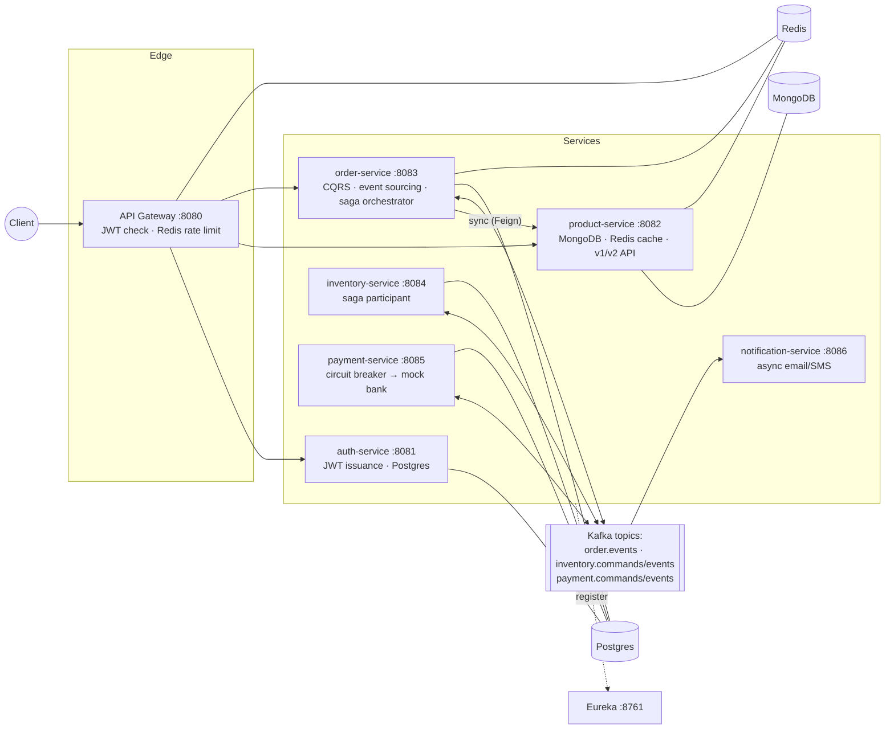
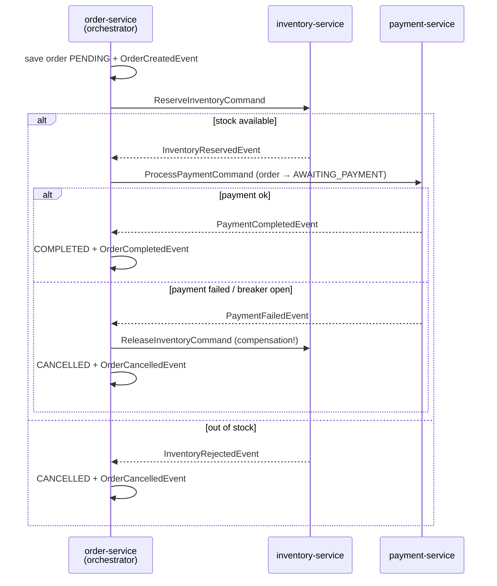

# ShopFlow — Spring Boot Microservices Showcase

An e-commerce backend built to demonstrate, **in one runnable system**, the
patterns that come up in real backend work and in backend interviews:
API gateway, JWT security, service discovery, CQRS, event sourcing on Kafka,
the saga pattern, circuit breakers, rate limiting, idempotency, Redis caching,
relational + non-relational persistence, and more.

Every concept is implemented in the smallest realistic way and **explained in
comments where it lives** — the repo doubles as a quick-reference handbook.
Use the [Concept → Code map](#-concept--code-map) to jump straight to any topic.

> **Domain choice:** e-commerce, because "place an order" naturally spans
> multiple services (catalog → order → inventory → payment → notification),
> which is exactly the shape that motivates sagas, CQRS, and events — without
> drowning in domain rules.

---

## 🏗 Architecture



**The order saga** (what happens after `POST /api/v1/orders`):



Each module has its own README (role, endpoints/topics, demo commands):
[discovery-server](discovery-server/README.md) ·
[api-gateway](api-gateway/README.md) ·
[auth-service](auth-service/README.md) ·
[product-service](product-service/README.md) ·
[order-service](order-service/README.md) ·
[inventory-service](inventory-service/README.md) ·
[payment-service](payment-service/README.md) ·
[notification-service](notification-service/README.md) ·
[common-events](common-events/README.md)

---

## 📚 Concept → Code map

| # | Concept | Where to look | One-liner |
|---|---------|---------------|-----------|
| 1 | **Request validation** | [`RegisterRequest`](auth-service/src/main/java/com/shopflow/auth/web/dto/RegisterRequest.java), [`CreateOrderRequest`](order-service/src/main/java/com/shopflow/order/web/dto/CreateOrderRequest.java) + custom [`@AllowedCurrency`](order-service/src/main/java/com/shopflow/order/web/dto/validation/AllowedCurrency.java) | `@Valid` + Bean Validation on DTOs; violations → 400 via `GlobalExceptionHandler` |
| 2 | **Qualifiers** | [`NotificationDispatcher`](notification-service/src/main/java/com/shopflow/notification/notify/NotificationDispatcher.java) | Two `NotificationSender` beans; `@Qualifier` picks email vs SMS |
| 3 | **fixedRate / fixedDelay** | [`MaintenanceJobs`](order-service/src/main/java/com/shopflow/order/scheduled/MaintenanceJobs.java) | All three `@Scheduled` styles; fixedDelay sweep doubles as the saga timeout |
| 4 | **Cron expressions** | same file | 6-field Spring cron, anatomy explained in the comment |
| 5 | **Thread pool for scheduled tasks** | [`SchedulingConfig`](order-service/src/main/java/com/shopflow/order/config/SchedulingConfig.java) | Default is single-threaded! `ThreadPoolTaskScheduler(4)` fixes it |
| 6 | **Spring profiles** | [`application.yml`](order-service/src/main/resources/application.yml) + [`-dev`](order-service/src/main/resources/application-dev.yml)/[`-prod`](order-service/src/main/resources/application-prod.yml) | dev = H2 zero-install; prod = Postgres + tuned pool |
| 7 | **Actuator** | every service's yml; richest in [order-service](order-service/src/main/resources/application.yml) | health/metrics/prometheus/scheduledtasks; opt-in exposure |
| 8 | **HikariCP** | [`application-prod.yml`](order-service/src/main/resources/application-prod.yml) | Every pool knob commented: sizing, timeouts, leak detection |
| 9 | **Caching annotations** | [`ProductService`](product-service/src/main/java/com/shopflow/product/service/ProductService.java) | `@Cacheable`/`@CachePut`/`@CacheEvict` + the proxy self-invocation gotcha |
| 10 | **Redis integration** | product cache, [gateway rate limiter](api-gateway/src/main/resources/application.yml), [`IdempotencyFilter`](order-service/src/main/java/com/shopflow/order/web/filter/IdempotencyFilter.java) | Three distinct Redis use-cases in one repo |
| 11 | **JWT + Spring Security** | [`JwtService`](auth-service/src/main/java/com/shopflow/auth/security/JwtService.java) (mint), [`JwtAuthFilter`](order-service/src/main/java/com/shopflow/order/security/JwtAuthFilter.java) + [`SecurityConfig`](order-service/src/main/java/com/shopflow/order/security/SecurityConfig.java) (verify) | Stateless auth; defense in depth (gateway **and** service verify) |
| 12 | **API gateway** | [`api-gateway`](api-gateway) | Spring Cloud Gateway: routing, edge JWT, rate limiting |
| 13 | **Relational + non-relational DBs** | JPA/Postgres in auth/order/inventory/payment; MongoDB in [`product-service`](product-service/src/main/java/com/shopflow/product/domain/Product.java) | Polyglot persistence, with the "why Mongo for catalogs" argument |
| 14 | **Idempotency** | [`IdempotencyFilter`](order-service/src/main/java/com/shopflow/order/web/filter/IdempotencyFilter.java) (HTTP) + [`Reservation`](inventory-service/src/main/java/com/shopflow/inventory/domain/Reservation.java)/[`Payment`](payment-service/src/main/java/com/shopflow/payment/domain/Payment.java) PK=orderId (consumers) | Stripe-style Idempotency-Key with response replay; idempotent Kafka consumers |
| 15 | **Circuit breaker** | [`PaymentProcessor`](payment-service/src/main/java/com/shopflow/payment/service/PaymentProcessor.java) + [resilience4j config](payment-service/src/main/resources/application.yml) | CLOSED→OPEN→HALF_OPEN, retry w/ backoff, fallback feeds the saga |
| 16 | **Rate limiting** | [gateway route filter](api-gateway/src/main/resources/application.yml) + [`RateLimiterConfig`](api-gateway/src/main/java/com/shopflow/gateway/config/RateLimiterConfig.java) | Redis token bucket, per-user key, 429 on burst |
| 17 | **CQRS** | write: [`OrderCommandService`](order-service/src/main/java/com/shopflow/order/command/OrderCommandService.java); read: [`OrderProjection`](order-service/src/main/java/com/shopflow/order/query/OrderProjection.java) → [`OrderQueryController`](order-service/src/main/java/com/shopflow/order/query/OrderQueryController.java) | Commands and queries hit different models; projection bridges via Kafka |
| 18 | **Service discovery** | [`discovery-server`](discovery-server/src/main/java/com/shopflow/discovery/DiscoveryServerApplication.java); consumed via `lb://` routes & [`ProductClient`](order-service/src/main/java/com/shopflow/order/client/ProductClient.java) | Eureka registry + client-side load balancing |
| 19 | **Backward compatibility** | [`ProductControllerV1`](product-service/src/main/java/com/shopflow/product/web/ProductControllerV1.java)/[`V2`](product-service/src/main/java/com/shopflow/product/web/ProductControllerV2.java); tolerant readers in [`common-events`](common-events/src/main/java/com/shopflow/common/events/OrderCreatedEvent.java) | v1+v2 side by side; additive-only event evolution |
| 20 | **Sync vs async communication** | sync: [`ProductClient`](order-service/src/main/java/com/shopflow/order/client/ProductClient.java) (Feign); async: everything Kafka | "Query synchronously, command asynchronously" |
| 21 | **Saga pattern** | [`OrderSagaOrchestrator`](order-service/src/main/java/com/shopflow/order/saga/OrderSagaOrchestrator.java) + participants | Orchestration variant, with compensation + timeout sweep |
| 22 | **Event sourcing (Kafka)** | [`OrderEventEntity`](order-service/src/main/java/com/shopflow/order/domain/OrderEventEntity.java), [`EventStoreService`](order-service/src/main/java/com/shopflow/order/command/EventStoreService.java), replay in [`OrderAggregate`](order-service/src/main/java/com/shopflow/order/query/OrderAggregate.java) | Append-only event store + Kafka stream; `GET /orders/{id}/rebuilt` proves state = fold(events) |
| 23 | **Distributed transactions** | saga (above); the honest dual-write/outbox discussion in [`EventStoreService`](order-service/src/main/java/com/shopflow/order/command/EventStoreService.java) | Why not 2PC; local transactions + compensation |
| 24 | **Service mesh** | [`deploy/istio/`](deploy/istio) | Sidecars, mTLS, canary routing — documented with manifests |
| 25 | **JPA & Spring Data JPA** | entities everywhere; derived queries in [`OrderRepository`](order-service/src/main/java/com/shopflow/order/repo/OrderRepository.java), [`UserRepository`](auth-service/src/main/java/com/shopflow/auth/repo/UserRepository.java) | Spec vs Hibernate vs Spring Data; optimistic locking via `@Version` |
| 26 | **Servlet filters** | [`RequestLoggingFilter`](order-service/src/main/java/com/shopflow/order/web/filter/RequestLoggingFilter.java) (correlation IDs), [`IdempotencyFilter`](order-service/src/main/java/com/shopflow/order/web/filter/IdempotencyFilter.java) | Filter vs interceptor explained where it matters |
| 27 | **Interceptors** | [`TimingInterceptor`](order-service/src/main/java/com/shopflow/order/web/interceptor/TimingInterceptor.java) + [`WebMvcConfig`](order-service/src/main/java/com/shopflow/order/config/WebMvcConfig.java) | Handler-aware per-endpoint timing |

---

## 🚀 Running it

### Prerequisites
- Java 17+ (built with 21), Maven 3.8+
- Docker Desktop (for Kafka/Redis/Mongo/Postgres)

### 1. Start infrastructure

```bash
docker compose up -d
```

### 2. Build everything

```bash
mvn clean install -DskipTests
```

### 3. Start the services (each in its own terminal, in this order)

```bash
mvn -pl discovery-server spring-boot:run      # 8761 - start FIRST
mvn -pl api-gateway spring-boot:run           # 8080
mvn -pl auth-service spring-boot:run          # 8081
mvn -pl product-service spring-boot:run       # 8082
mvn -pl order-service spring-boot:run         # 8083
mvn -pl inventory-service spring-boot:run     # 8084
mvn -pl payment-service spring-boot:run       # 8085
mvn -pl notification-service spring-boot:run  # 8086
```

Services default to the **dev** profile (H2 in-memory relational DBs — only
Kafka/Redis/Mongo needed from Docker). Switch any service to Postgres with
`SPRING_PROFILES_ACTIVE=prod`.

Eureka dashboard: <http://localhost:8761> — wait until all services appear.

### 4. Walk through the flow (everything via the gateway, port 8080)

```bash
# Register -> grab the JWT
TOKEN=$(curl -s -X POST localhost:8080/api/v1/auth/register \
  -H 'Content-Type: application/json' \
  -d '{"email":"dev@shopflow.io","password":"secret123","fullName":"Dev User"}' \
  | sed -E 's/.*"token":"([^"]+)".*/\1/')

# Browse the catalog (2nd call hits the Redis cache - watch product-service logs)
curl -s localhost:8080/api/v1/products/p-1001 -H "Authorization: Bearer $TOKEN"
curl -s localhost:8080/api/v2/products/p-1001 -H "Authorization: Bearer $TOKEN"   # v2 shape

# Place an order (saga kicks off; note the Idempotency-Key)
curl -s -X POST localhost:8080/api/v1/orders \
  -H "Authorization: Bearer $TOKEN" -H 'Content-Type: application/json' \
  -H 'Idempotency-Key: demo-key-1' \
  -d '{"productId":"p-1001","quantity":2,"currency":"USD"}'

# Retry the EXACT same request -> replayed response, no second order
# (look for the X-Idempotent-Replay: true header)
curl -si -X POST localhost:8080/api/v1/orders \
  -H "Authorization: Bearer $TOKEN" -H 'Content-Type: application/json' \
  -H 'Idempotency-Key: demo-key-1' \
  -d '{"productId":"p-1001","quantity":2,"currency":"USD"}' | head -20

# Check the outcome (CQRS read model): COMPLETED or CANCELLED
curl -s localhost:8080/api/v1/orders/<orderId> -H "Authorization: Bearer $TOKEN"

# Event sourcing: full history + state rebuilt purely from events
curl -s localhost:8080/api/v1/orders/<orderId>/events  -H "Authorization: Bearer $TOKEN"
curl -s localhost:8080/api/v1/orders/<orderId>/rebuilt -H "Authorization: Bearer $TOKEN"
```

### 5. Break things on purpose (the fun part)

| Demo | How | What you'll see |
|------|-----|-----------------|
| Saga compensation | order `p-1003` with `quantity: 3` (only 2 in stock) | `CANCELLED` with "insufficient stock"; events show the path |
| Circuit breaker | set `app.bank.failure-rate: 1.0` in payment-service, place ~6 orders | breaker `OPEN` in `localhost:8085/actuator/circuitbreakers`; instant fallbacks; orders cancelled + stock released |
| Rate limiting | hammer `POST /orders` >10x in a second | `429 Too Many Requests` + `X-RateLimit-*` headers |
| Validation | `"quantity": 0` or `"currency":"GBP"` | 400 with per-field errors |
| Cache | `GET /products/p-1001` twice | "CACHE MISS" log appears only once |
| Auth | any call without `Authorization` header | 401 from the gateway |
| Saga timeout | stop inventory-service, place an order, wait ~10 min | fixedDelay sweep cancels the stuck order |

---

## 🎯 Design decisions worth defending in an interview

1. **Saga over 2PC** — 2PC holds locks across services and dies with its
   coordinator; sagas use local transactions + compensations and accept
   eventual consistency. `OrderSagaOrchestrator` documents orchestration vs
   choreography trade-offs.
2. **Known gap, on purpose: the dual-write problem** — `EventStoreService`
   writes the DB and publishes to Kafka non-atomically, and its Javadoc
   explains the production fix (transactional outbox + CDC). Owning a
   limitation beats pretending it isn't there.
3. **202 Accepted for order creation** — fulfillment is async; the API is
   honest about it and hands back a pollable resource.
4. **HS256 shared secret** — simplest thing that demonstrates JWT flow;
   comments state why production wants RS256 + JWKS.
5. **Snapshot + event store** instead of purist event sourcing — the
   pragmatic hybrid most real systems run; `/rebuilt` proves the purist
   derivation still works.
6. **Eureka here, DNS there** — service discovery is shown with Eureka
   because it's the Spring-native story; `deploy/istio/` explains why K8s
   replaces it with platform primitives.

## ⚠️ Deliberately out of scope

Flyway migrations, OpenTelemetry tracing, Testcontainers integration tests,
Kubernetes deployment of the services themselves, and real payment/SMTP
integrations — all worthy, all orthogonal to the patterns being demonstrated.

## License

MIT — use it, fork it, learn from it.
