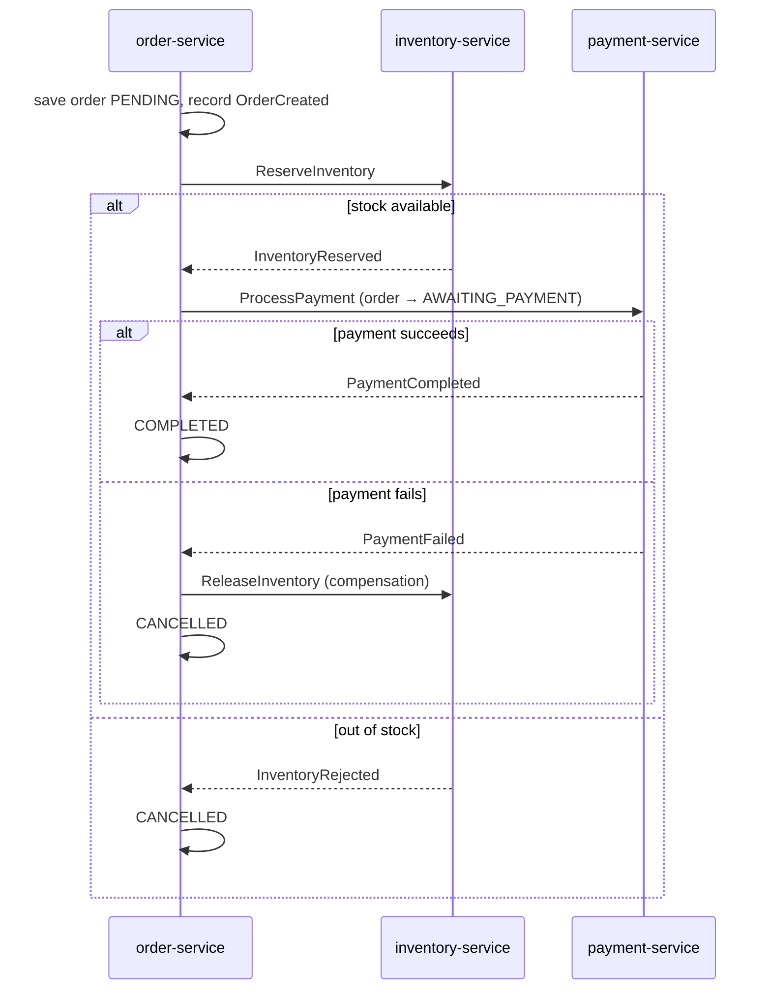

# ShopFlow

An e-commerce backend built as a set of Spring Boot microservices: a gateway,
six services, an event-driven order flow on Kafka, and both relational and
document storage.

Placing an order spans three services, so it runs as a **saga** — a chain of
local transactions with compensating actions when a step fails. Orders are
stored as an **event stream**, and reads are served from a separate model built
from those events.


---

## Services

| Service | Port | Responsibility | Storage |
|---|---|---|---|
| [discovery-server](discovery-server) | 8761 | Service registry (Eureka) | — |
| [api-gateway](api-gateway) | 8080 | Routing, token verification, rate limiting | Redis |
| [auth-service](auth-service) | 8081 | Accounts and JWT issuance | Postgres / H2 |
| [product-service](product-service) | 8082 | Product catalog, v1 and v2 APIs | MongoDB, Redis |
| [order-service](order-service) | 8083 | Orders, event store, saga orchestration, read model | Postgres / H2, Redis |
| [inventory-service](inventory-service) | 8084 | Stock reservation and release | Postgres / H2 |
| [payment-service](payment-service) | 8085 | Payments behind a circuit breaker | Postgres / H2 |
| [notification-service](notification-service) | 8086 | Email and SMS on order events | — |
| [common-events](common-events) | — | Shared Kafka message contracts | — |

Each service has its own README with its endpoints, topics and a few commands
to exercise it.

## The order saga



If a service never replies, a scheduled sweep in order-service cancels orders
stuck past a timeout and releases any stock they hold.

## Running it

**Requirements:** Java 21, Maven 3.8+, Docker.

```bash
docker compose up -d      # Kafka, Redis, MongoDB, Postgres
mvn clean install
```

Then start each service in its own terminal, **discovery-server first**:

```bash
mvn -pl discovery-server spring-boot:run
```

followed by `api-gateway`, `auth-service`, `product-service`, `order-service`,
`inventory-service`, `payment-service` and `notification-service`.

Services default to the `dev` profile, which uses in-memory H2, so only Kafka,
Redis and MongoDB are needed from Docker. Set `SPRING_PROFILES_ACTIVE=prod` to
use Postgres instead. Wait for all services to appear at <http://localhost:8761>
before sending requests.

### Placing an order

```bash
TOKEN=$(curl -s -X POST localhost:8080/api/v1/auth/register \
  -H 'Content-Type: application/json' \
  -d '{"email":"dev@shopflow.io","password":"secret123","fullName":"Dev User"}' \
  | sed -E 's/.*"token":"([^"]+)".*/\1/')

curl -s localhost:8080/api/v1/products/p-1001 -H "Authorization: Bearer $TOKEN"

curl -s -X POST localhost:8080/api/v1/orders \
  -H "Authorization: Bearer $TOKEN" -H 'Content-Type: application/json' \
  -H 'Idempotency-Key: demo-1' \
  -d '{"productId":"p-1002","quantity":1,"currency":"USD"}'

# outcome, full event history, and state replayed from those events
curl -s localhost:8080/api/v1/orders/<orderId>          -H "Authorization: Bearer $TOKEN"
curl -s localhost:8080/api/v1/orders/<orderId>/events   -H "Authorization: Bearer $TOKEN"
curl -s localhost:8080/api/v1/orders/<orderId>/rebuilt  -H "Authorization: Bearer $TOKEN"
```

Order creation returns `202 Accepted` with status `PENDING`. The saga resolves
it to `COMPLETED` or `CANCELLED` a moment later.

### Things to try

| To see | Do this |
|---|---|
| Compensation | Order `p-1003` with quantity 5 — only 2 are in stock, so the order is cancelled |
| Circuit breaker | Set `app.bank.failure-rate: 1.0` in payment-service, restart, place a few orders, then check `localhost:8085/actuator/circuitbreakers` |
| Idempotency | Send the same order twice with one `Idempotency-Key` — the second returns the first response with `X-Idempotent-Replay: true` |
| Rate limiting | Send more than 10 order requests in a second — the rest return 429 |
| Caching | Request the same product twice — product-service logs a cache miss only the first time |
| Validation | Send `"quantity": 0` or `"currency": "GBP"` — returns 400 with the failing fields |
| Saga timeout | Stop inventory-service, place an order, wait ten minutes — the sweep cancels it |

## Where things live

| Topic | Files |
|---|---|
| Saga orchestration and compensation | [OrderSagaOrchestrator](order-service/src/main/java/com/shopflow/order/saga/OrderSagaOrchestrator.java), [InventoryService](inventory-service/src/main/java/com/shopflow/inventory/service/InventoryService.java) |
| Event store and replay | [EventStoreService](order-service/src/main/java/com/shopflow/order/command/EventStoreService.java), [OrderEventEntity](order-service/src/main/java/com/shopflow/order/domain/OrderEventEntity.java), [OrderAggregate](order-service/src/main/java/com/shopflow/order/query/OrderAggregate.java) |
| Command and query separation | [OrderCommandService](order-service/src/main/java/com/shopflow/order/command/OrderCommandService.java), [OrderProjection](order-service/src/main/java/com/shopflow/order/query/OrderProjection.java), [OrderQueryController](order-service/src/main/java/com/shopflow/order/query/OrderQueryController.java) |
| Idempotency | [IdempotencyFilter](order-service/src/main/java/com/shopflow/order/web/filter/IdempotencyFilter.java), [Reservation](inventory-service/src/main/java/com/shopflow/inventory/domain/Reservation.java), [Payment](payment-service/src/main/java/com/shopflow/payment/domain/Payment.java) |
| Circuit breaker and retry | [PaymentProcessor](payment-service/src/main/java/com/shopflow/payment/service/PaymentProcessor.java), [payment config](payment-service/src/main/resources/application.yml) |
| Authentication | [JwtService](auth-service/src/main/java/com/shopflow/auth/security/JwtService.java), [gateway filter](api-gateway/src/main/java/com/shopflow/gateway/filter/JwtAuthenticationGlobalFilter.java), [JwtAuthFilter](order-service/src/main/java/com/shopflow/order/security/JwtAuthFilter.java) |
| Rate limiting | [gateway routes](api-gateway/src/main/resources/application.yml), [RateLimiterConfig](api-gateway/src/main/java/com/shopflow/gateway/config/RateLimiterConfig.java) |
| Caching | [ProductService](product-service/src/main/java/com/shopflow/product/service/ProductService.java), [RedisCacheConfig](product-service/src/main/java/com/shopflow/product/config/RedisCacheConfig.java) |
| Filters and interceptors | [RequestLoggingFilter](order-service/src/main/java/com/shopflow/order/web/filter/RequestLoggingFilter.java), [TimingInterceptor](order-service/src/main/java/com/shopflow/order/web/interceptor/TimingInterceptor.java) |
| Scheduled jobs | [MaintenanceJobs](order-service/src/main/java/com/shopflow/order/scheduled/MaintenanceJobs.java), [SchedulingConfig](order-service/src/main/java/com/shopflow/order/config/SchedulingConfig.java) |
| Async work and qualifiers | [NotificationDispatcher](notification-service/src/main/java/com/shopflow/notification/notify/NotificationDispatcher.java), [AsyncConfig](notification-service/src/main/java/com/shopflow/notification/config/AsyncConfig.java) |
| Sync service call | [ProductClient](order-service/src/main/java/com/shopflow/order/client/ProductClient.java) |
| API versioning | [ProductControllerV1](product-service/src/main/java/com/shopflow/product/web/ProductControllerV1.java), [ProductControllerV2](product-service/src/main/java/com/shopflow/product/web/ProductControllerV2.java) |
| Connection pool tuning | [application-prod.yml](order-service/src/main/resources/application-prod.yml) |
| Service mesh manifests | [deploy/istio](deploy/istio) |

## Design notes

**Sagas rather than distributed transactions.** A transaction can't span three
databases, and two-phase commit holds locks across the network. Each step
commits locally and failures are undone with compensating commands. The cost is
eventual consistency, so every intermediate state is explicit and recoverable.

**Queries are synchronous, commands are asynchronous.** Order creation calls
product-service directly because it can't proceed without a price. Everything
else goes through Kafka, so a service being briefly unavailable delays work
instead of failing it.

**Reads come from a projection.** The read model is built by consuming the event
stream, which means it lags the write side slightly and can be rebuilt or moved
to a different store without touching order creation.

**Consumers are idempotent.** Kafka delivers at least once, so reservations and
payments use the order id as their primary key and a redelivered command is
recognised rather than applied twice.

## Known gaps

- **The event store write and the Kafka publish are not atomic.** If the process
  dies between them, the event is stored but never published. A transactional
  outbox with a relay would fix this.
- **No integration tests yet.** Testcontainers would let the saga be tested
  end to end.
- **HS256 shared secret for tokens.** Every verifier could also mint tokens;
  RS256 with a published public key would be the better choice.
- **Schema is generated by Hibernate.** Real deployments should use Flyway or
  Liquibase.

## Diagrams

`docs/` holds the architecture diagram above, an e-commerce reference
architecture, and a general microservices request-flow diagram, each as SVG
and PNG.

## License

MIT
